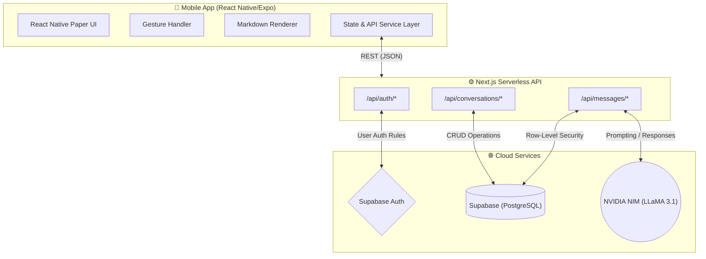

<div align="center">
  
  <h1>✨ Super-MCP-App ✨</h1>
  <p><b>Your Intelligent, Native Mobile AI Assistant</b></p>
  
  <p>
    <a href="https://github.com/Super-MCP-App/Super-MCP-App/graphs/contributors"></a>
    <a href="https://github.com/Super-MCP-App/Super-MCP-App/network/members"></a>
    <a href="https://github.com/Super-MCP-App/Super-MCP-App/stargazers"></a>
    <a href="https://github.com/Super-MCP-App/Super-MCP-App/issues"></a>
    <a href="https://github.com/Super-MCP-App/Super-MCP-App/blob/main/LICENSE"></a>
  </p>

  <p>A fast, sleek, and highly capable mobile AI chat application built with React Native (Expo) and Next.js, powered by <b>Meta LLaMA 3.1</b> and <b>Supabase</b>.</p>
</div>

---

## 🌟 Key Features

- **💬 Real-Time Conversational AI** – Speak with an intelligent agent powered by the LLaMA 3.1 8B model via NVIDIA NIM.
- **📱 Native Mobile Experience** – Built on React Native & Expo for smooth, native-like iOS and Android performance.
- **🎨 Modern Material 3 Design** – Beautifully constructed interfaces with `@react-native-paper` utilizing customized color tokens.
- **📝 Markdown Support** – Full rich-text rendering of AI responses, including syntax-highlighted code blocks (`react-native-markdown-display`).
- **🔄 Swipe-to-Delete** – Fluid, gesture-based conversation management right from your chat list (Powered by `react-native-gesture-handler`).
- **🔐 Secure & Serverless Backend** – Next.js acts as an API gateway safely routing AI requests, backed by Supabase for authentication and persistent chat storage.

---

## 🛠️ Technology Stack

### App (Frontend)
- **Framework**: React Native & Expo
- **Navigation**: React Navigation (Bottom Tabs & Stack Navigators)
- **UI/Styling**: React Native Paper
- **Gestures**: React Native Gesture Handler
- **Markdown**: React Native Markdown Display

### API & Database (Backend)
- **API Framework**: Next.js 16 (App Router)
- **Database & Auth**: Supabase (PostgreSQL with Row-Level Security)
- **AI Engine**: NVIDIA API (OpenAI-compatible endpoints running `meta/llama-3.1-8b-instruct`)

---

## 🏗️ System Architecture

The project follows a modern, decoupled architecture ensuring scale and security by preventing mobile clients from ever having direct access to DB keys or AI API keys.



---

## 🚀 Getting Started

Follow these steps to get the app running locally on your machine and simulator.

### Prerequisites
Before you begin, ensure you have the following installed and configured:
- [Node.js](https://nodejs.org/en/) (v18 or higher) and npm
- [Expo CLI](https://docs.expo.dev/get-started/installation/)
- A [Supabase](https://supabase.com/) account (for DB & Auth)
- An [NVIDIA NIM](https://build.nvidia.com/) API Key for AI inference

### 1. Setup Backend
The backend utilizes Next.js App Router as a secure API Gateway.
```bash
# Navigate to the backend directory
cd backend

# Install dependencies
npm install
```

Create a `.env` file in the `backend/` directory matching your configuration details:
```env
NEXT_PUBLIC_SUPABASE_URL=your_supabase_url
NEXT_PUBLIC_SUPABASE_ANON_KEY=your_supabase_anon_key
SUPABASE_SERVICE_ROLE_KEY=your_supabase_service_role_key

# NVIDIA AI Configuration
NVIDIA_API_KEY=your_nvidia_nim_api_key
NVIDIA_BASE_URL=https://integrate.api.nvidia.com/v1

# Local Network App Configuration
NEXT_PUBLIC_API_URL=http://127.0.0.1:3000
```

Start the API development server:
```bash
npm run dev
```

### 2. Setup Mobile App
In the root project directory, install the Expo packages:
```bash
# Return to the root folder
cd ..

# Install app dependencies
npm install

# Start the Expo bundler
npx expo start
```
From the Expo terminal, press `i` to open the iOS Simulator or scan the QR code using the **Expo Go** app on your physical device.

---

## 📦 Project Structure

```text
Super-MCP-App/
├── src/                # Front-end React Native App
│   ├── navigation/     # Tab and Stack Navigators
│   ├── screens/        # React Native Screens (Home, Chat, Profile, etc.)
│   ├── services/       # API Fetch Handlers & Supabase configs
│   └── theme/          # UI themer (Colors, Typography)
├── backend/            # Next.js Backend API
│   ├── app/api/        # Serverless Routes (Messages, Conversations, Auth)
│   └── lib/            # NVIDIA SDK handlers and Supabase Admin
└── README.md           
```

---

## 🤝 Contributing

We welcome contributions from the community! Whether it's adding new features, fixing bugs, or improving documentation, your help makes Super-MCP-App better for everyone.

Please read our [Contributing Guidelines](/.github/CONTRIBUTING.md) to get started with setting up your development environment and submitting Pull Requests.

---

## 🐛 Issues and Bug Reports

Found a bug or have a great idea for a new feature? We'd love to hear about it!
Please use our [Issue Tracker](https://github.com/Super-MCP-App/Super-MCP-App/issues) to report bugs or request features. We have templates prepared to help you provide all the necessary information.

---

<div align="center">
  <i>Designed for fluidity, powered by modern AI.</i>
  <br>
  <br>
  Made with ❤️ by the Super-MCP-App Open Source Organization.
</div>
